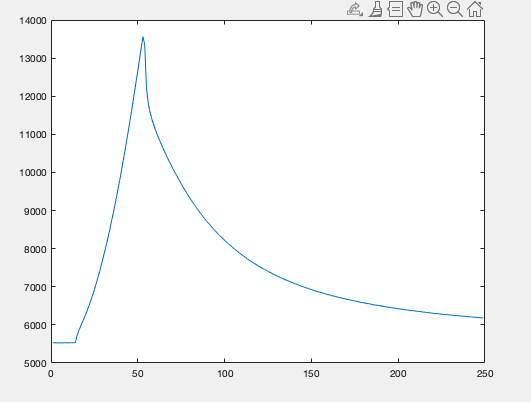

# Industrial Failure Detection with Neural Networks

## Overview

Matlab Scripts used for extracting images from .mat files.

- Script 'Auswertung_v1_lk.m' used for extracting files. Inside, Line 157 specifying which films to process, Line 254 specifying which images to extract from each film.
- Script 'IntensityPlot.m' used for plot thermal intensity of each film.

